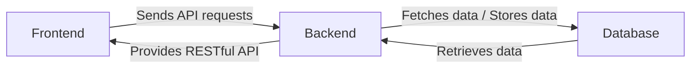

# Quizzer-software by project team pepperpot
School project. In this project the end goal is to make a software where the user can answer questions.

## Team members
- Kosti Kangasmaa https://github.com/kostikangasmaa
- Edward Takaeilola https://github.com/eetutakaeilola365
- Hilja Katajamäki https://github.com/hilja04
- Vilho Karhu https://github.com/kvilho
- Ikechukwu Aniebonam https://github.com/ikeani

## Links
   __Backlog link:__
   https://github.com/users/eetutakaeilola365/projects/1/views/3
   
   __Deployment link:__
   https://pepperpot-quizzer.onrender.com/quizlist


## Developer guide

### Architecture


### Components
The project is structured into three main components:

 - __`Back end`:__
   The Back end is implemented using Java and Spring Boot. It handles the application’s logic, such as managing quizzes, questions, answers, Categories and user submissions. It communicates with the database and provides a RESTful API that the frontend uses. The backend uses Thymeleaf to provide the teacher interface, while the front end handles the student interface.
   
- __`Front end`:__
   The Front end is implemented using React and Javascript. It makes requests to the RESTful API provided by the backend to retrieve and submit data. It uses libraries such as AG-Grid, React Router and MUI (Material UI). The front end provides the user interface for students, allowing them to take quizzes and view results. 
 - __`Database`:__
   The application uses PostgreSQL as the database for production, and H2 is used in the development environment. The database stores all the data related to quizzes, questions, answers, categories, and submissions. The backend interacts with the database using Spring Data JPA and Hibernate.

### How to start the Back end application

#### 1. __System requirements:__
   - `Java version 17`
   - `maven`

#### 2. __Starting the Back End application__
   - Clone the repository `git clone <repository-url>`
   - Navigate to the folder of the repository and open command line
   - In the folder run the command `mvnw spring-boot:run`

### How to start the Front end application:

#### 1. __System requirements:__
   - `Node.js`
   - `npm` 
#### 2. __Starting the Front End application:__
   - Navigate to the folder of the front end `queryFrontend`
   - Open command line in that folder
   - Install the front end dependencies by running `npm install`
   - Start the front end application using `npm run dev`


## Data model

### Documentation:


1. `Quiz` Entity represents a quiz containing a set of questions (Question) and is associated with a category (Category). 

   **Attributes:**

      - `Quizid` (long) - Unique identifier for the quiz
      - `Name` (string) - Name of the quiz
      - `Description` (string) - Short description of the quiz
      - `Published` (boolean) - Indicates if the quiz is published or unpublished
      - `Date` (localdate) - The date the quiz was created

   **Relationships:**
      - One to many (Quiz → Question)
      - Many to one (Quiz → Category)
      - One to Many (Quiz → Review)

2. `Question` Entity represents a question belonging to a quiz (Quiz) and contains answer options (Answer).

   **Attributes:**

      - `Questionid` (long) - Unique identifier for the question
      - `Name` (string) - text of the question
      - `Difficulty` (string) - The difficulty level of the question

   **Relationships:**
      - Many to one (Question → Quiz)  
      - One to many (Question → Answer)
        
3. `Answer` Entity represents one answer option for a question (Question). Each answer can receive multiple submissions (Submission) when selected.

   **Attributes:**

      - `Answerid` (long) - Unique identifier for the answer
      - `Choice` (string) - The answer choice text
      - `Correct` (boolean) - Indicates if the answer is correct or incorrect

   **Relationships:**
      - Many to one (Answer → Question)
      - One to many (Answer → Submission)

4. `Category` Entity represents a category that contains multiple quizzes (Quiz).

   **Attributes:**

      - `Categoryid` (long) - Unique identifier for the category
      - `Name` (string) - Name of the category
      - `Description` (string) - Short description of the category

   **Relationships:**
      - One to many (Category → Quiz)


5. `Submission` Entity represents the user's submission, where they have selected an answer option (Answer) for a question (Question). Each submission is linked to an answer (Answer).

   **Attributes:**

      - `Submissionid` (long) - Unique identifier for the submission

   **Relationships:**
      - Many to one (Submission → Answer)
        
6. `Review` Entity represents the user's review for a Quiz (Quiz).
   
    **Attributes:**
      - `Reviewid` (long) - unique identifier for the review
      - `Nickname` (string) - reviewer's nicname
      - `Rating` (integer) - A score (1-5) for the quiz where 1 is bad and 5 is great
      - `Reviewtext` - A short text to give written feedback

    **Relationships:**
      - Many to one (Review → Quiz)
      


### Entity relationship diagram:

```mermaid
erDiagram
   Quiz ||--o{ Question : ""
   Quiz ||--o{ Review : ""
   Quiz {
      long quizid
      string name
      string description
      boolean published
      localDate date
   }
   Question ||--o{ Answer : ""
   Question{
      long questionid
      string name
      string difficulty
   }
   Answer ||--o{ Submission : ""
   Answer{
      long answerid
      string choice
      boolean correct
   }
   Category ||--o{ Quiz : ""
   Category{
      long categoryid
      string name
      string description
   }
   Submission{
      long submissionid
   }
   
   Review{
      long reviewid
      string nickname
      integer rating
      string reviewtext
   }
